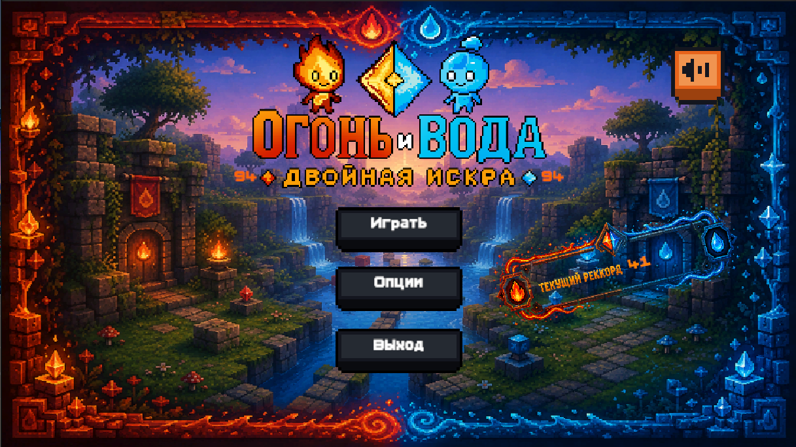
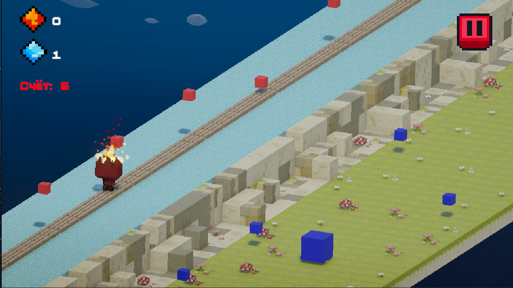

# Smartfonio-Internship-Week3-Fire-and-Water-A-double-spark-
# 🔥💧 Огонь и Вода: Двойная Искра

  

**Динамичный 3D сайд-скроллер раннер**, в котором один игрок одновременно управляет двумя стихийными духами при помощи раздельного управления. Реакция, координация и чёткое распределение внимания — вот что решает, как далеко забегут Огонь и Вода.

---

## 📖 Сюжет

В мире, где стихии Огня и Воды вечно противостояли друг другу, произошёл раскол. Древний кристалл равновесия, поддерживавший гармонию, разбился на две части — **Искру** и **Каплю**. Без них мир начал угасать: огонь гас, вода испарялась.

Два духа-хранителя вызвались добежать до Сердца Мира и восстановить кристалл. Однако путь лежит через **Лабиринт Стихий**, где каждая зона враждебна для одного из них. Только вместе, синхронизируя каждое движение, они смогут преодолеть ловушки и вернуть равновесие.

Игроку предстоит стать тем, кто поведёт их в этом смертельном забеге, где доверие и реакция решают всё.

---

## 🎮 Геймплей

  

Игра — бесконечный раннер с автоматическим продвижением вперёд. Экран разделён на две дорожки:

- 🔴 **Левая дорожка** — персонаж **Огонь**
- 🔵 **Правая дорожка** — персонаж **Вода**

Оба героя бегут вперёд одновременно и автоматически, а игрок в реальном времени переключается вниманием между двумя совершенно разными типами управления.

### Управление

| Персонаж | Действие | Клавиши |
| --- | --- | --- |
| 🔥 Огонь | Прыжок вверх (перепрыгнуть препятствие снизу) | `W` / `↑` |
| 🔥 Огонь | Присесть (уйти под препятствие сверху) | `S` / `↓` |
| 💧 Вода | Сместиться на полосу влево | `A` / `←` |
| 💧 Вода | Сместиться на полосу вправо | `D` / `→` |

### Препятствия

**Огонь** (вертикальная механика — прыжок/присед):
- Низкие водяные лужи и ледяные шипы — нужно перепрыгнуть.
- Нависающие синие барьеры и арки — нужно нагнуться.

**Вода** (горизонтальная механика — смена полос):
- Огненные столбы и лавовые лужи, перекрывающие полосу.
- Красные барьеры, требующие перестроения на соседнюю полосу.

Иногда препятствия синхронизируются — например, Огню нужно прыгнуть в тот же момент, когда Воде нужно сместиться в сторону, что требует от игрока чёткого распределения внимания между двумя типами реакции.

### Сбор ресурсов

- 🔺 **Красные искры** — на дорожке Огня, собирает Огонь.
- 🔷 **Синие капли** — на дорожке Воды, собирает Вода.

Если персонаж пропускает свой ресурс, второй подобрать его не может.

### Единая «жизнь»

Огонь и Вода делят одну жизнь на двоих: столкновение любого из персонажей с бомбой заканчивает забег для обоих сразу. Это резко поднимает ставки и держит игрока в напряжении на всей дистанции.

---

## ✨ Ключевые особенности

1. **Один игрок — два типа движения.** Игрок одновременно управляет вертикальным движением Огня (прыжок/присед) и горизонтальным движением Воды (смена полос), используя раздельные клавиши для каждого персонажа.
2. **Асинхронные препятствия.** Препятствия на дорожках Огня и Воды появляются независимо друг от друга, заставляя игрока постоянно следить за обеими зонами экрана.
3. **Разные механики управления.** Огонь использует классическую вертикальную механику раннера, а Вода — смену полос, что создаёт два разных по ощущениям стиля игры в рамках одной сессии.
4. **Единая «жизнь».** Проигрыш одного персонажа означает проигрыш обоих — простое правило, которое радикально повышает напряжение.
5. **Нарастающая сложность.** Скорость и частота появления бомб плавно растут со временем, вынуждая игрока действовать всё быстрее.
6. **Сохранение рекордов.** Игра запоминает лучший результат и отдельный счёт по искрам и каплям между сессиями (`PlayerPrefs`).

---

## 🛠️ Технологии

- **Движок:** Unity (3D, `CharacterController`-based персонажи)
- **Язык:** C#
- **UI:** TextMeshPro + встроенный UI Text
- **Поддержка мобильных платформ:** отдельный UI-блок, включаемый автоматически на мобильных устройствах

### Структура основных скриптов

| Скрипт | Назначение |
| --- | --- |
| `GameManager` | Центральный менеджер сцены: очки, пауза, рестарт, сохранение и загрузка рекордов |
| `MainMenuManager` | Загрузка сохранённой статистики и запуск игры из главного меню |
| `FireController` | Вертикальное управление Огнём: прыжок, присед, гравитация |
| `WaterController` | Горизонтальное управление Водой: смена полос, гравитация |
| `PlayerAnimation` | Синхронизация состояний аниматора (`Jump`, `Run`, `Down`) с действиями игрока |
| `Tile` / `TileGenerator` | Бесконечная генерация уровня: спавн тайлов, монет и бомб на двух дорожках, рост сложности |
| `Coin` | Подбор ресурса и начисление очков соответствующей стихии |
| `Bomb` | Столкновение с препятствием — завершение забега |
| `NewScoreAnimationHandler` | Показ анимации нового рекорда |
| `SnapToGrid` / `SnapToGridSystem` | Редакторский инструмент: привязка объектов к сетке и «магнитное» примыкание соседних блоков при выстраивании уровня в Scene View |
| `RandomPrefabReplacer` | Случайная замена точек-заглушек на один из вариантов префабов при инициализации сцены |

---

## 🚀 Как запустить

1. Открыть проект в Unity (версия, использованная при разработке).
2. Загрузить сцену главного меню и нажать **Play**.
3. Управлять Огнём клавишами `W`/`S`, Водой — `A`/`D`, стараясь провести обоих героев как можно дальше.

---

<i>Доверие и реакция решают всё. Удачного забега! 🔥💧</i>

